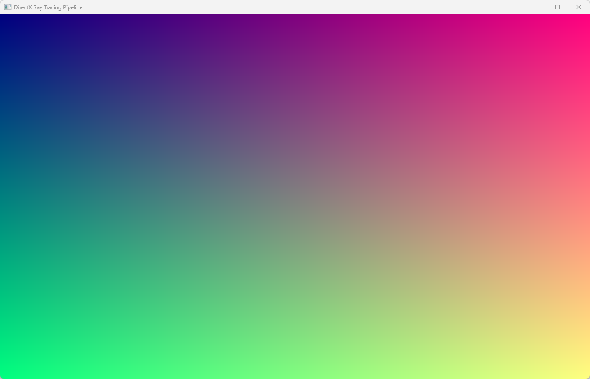
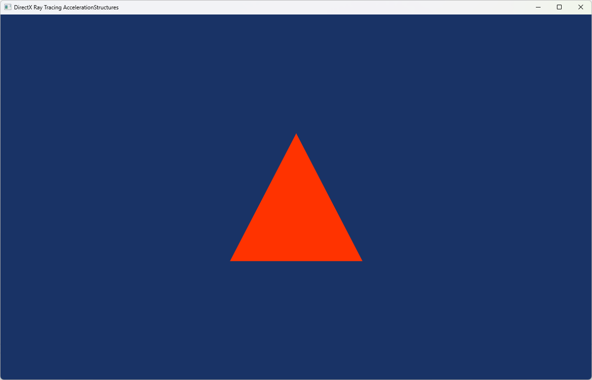
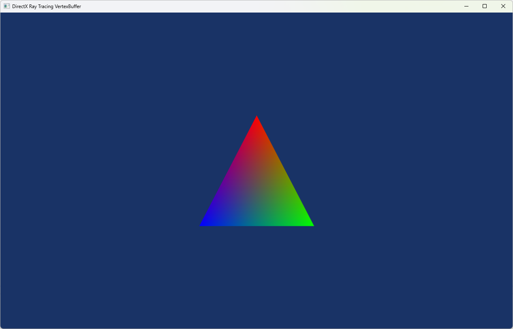
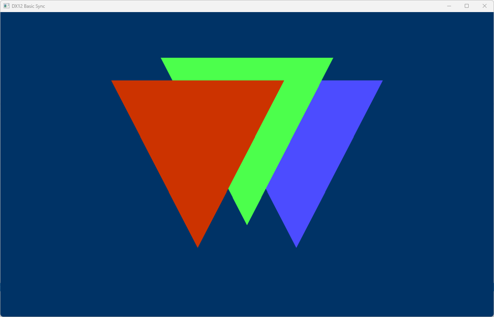
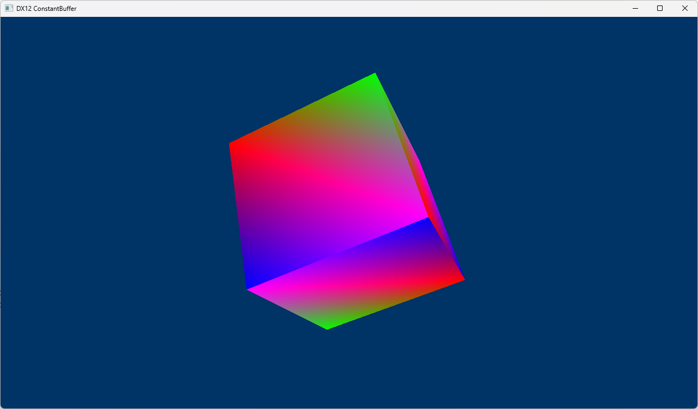
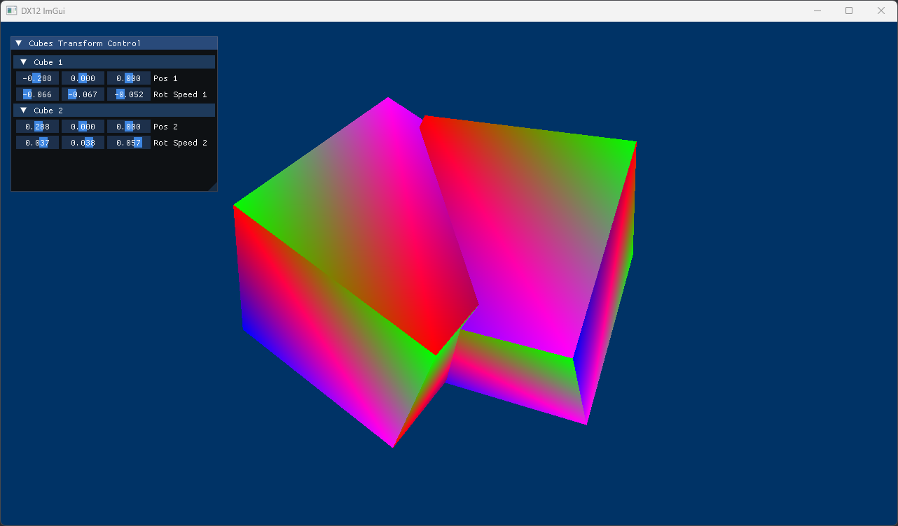
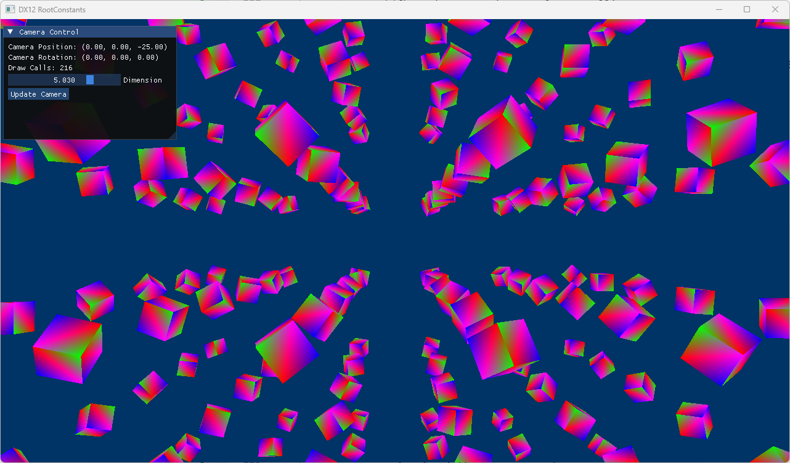

            

# 🌀 DirectX 12 Ultimate® Samples

 

📝This repository contains **small, progressive DirectX 12 examples**, designed to teach and demonstrate each part of the graphics pipeline in an intuitive and minimalistic way.  
Each sample is isolated and focused, making it easy to learn DX12 step by step, without unnecessary complexity.

 

## Examples

Example | Details
---------|--------
 | [Pipeline](Src/Pipeline)  This example shows how to use DirectX Raytracing (DXR) to write directly to a texture using a ray generation shader. No acceleration structures or geometry are used — this is the simplest possible DXR setup, useful to understand how DispatchRays works and how GPU threads map to pixels. (PSOs [ID3D12PipelineState])
 | [AccelerationStructures](Src/AccelerationStructures)  This example introduces acceleration structures (BLAS and TLAS) and shows how to trace rays against real geometry. A single triangle is built into a bottom-level acceleration structure and instanced in a top-level structure. Rays are dispatched and intersect the triangle using the ray tracing pipeline (ray generation, miss, and closest hit shaders).
 | [VertexBuffer](Src/VertexBuffer)  Let's get some color in our scene. In this tutorial we will add color to our vertices to color our triangle. This involves updating the vertex shader to pass the color to the pixel shader, the pixel shader to output the color passed to it, the vertex structure to add a color attribute, and the input layout to include a color input element.
 | [IndexBuffer](Src/IndexBuffer)  In this tutorial we will learn how to use indices to define our triangles. This is useful because we can remove duplicate vertices, as many times the same vertex is used in multiple triangles.
 | [Basic Sync](Src/BasicSynchronizing)  This example adds basic synchronization using ID3D12Fence to ensure that the GPU has completed its work before reusing resources. It also properly handles window resizing by recreating the Render Target Views (RTVs) and Depth/Stencil Views (DSVs) whenever the swap chain is resized.
 | [Blending](Src/Blending)  Here we will learn about a technique called "blending"! This will give us the ability to render "transparent" primitives.
 | [ConstantBuffer](Src/ConstantBuffer)  In this sample, we will learn about matrices, transformations, world/view/projection space matrices, and constant buffers
 | [ImGui](Src/ImGui) This sample shows how to use ImGui with DirectX 12 to control two 3D cubes.
 | [RootConstants](Src/RootConstants) Uses SetGraphicsRoot32BitConstants, small blocks of uniform data stored within a command list, to pass data to a shader without the need for uniform buffers.

## 📘 Goals

- Help others learn how to use **pure DirectX 12**.
- Serve as a personal reference for building engines or tools.
- Keep things clean, readable, and low-level.

## 🎯 Requirements

- Windows 10/11
- Visual Studio 2019 or newer
- DirectX 12 compatible GPU
