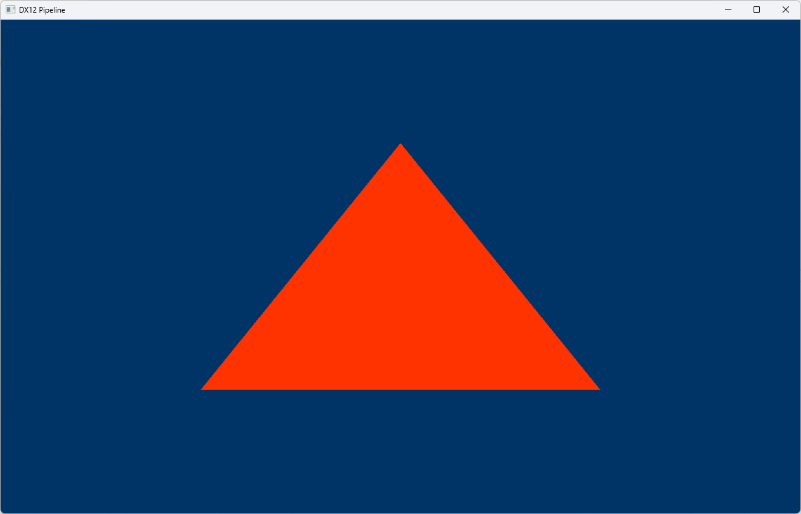

            

# 🌀 DirectX 12 Ultimate® Samples

 

This repository contains **small, progressive DirectX 12 examples**, designed to teach and demonstrate each part of the graphics pipeline in an intuitive and minimalistic way.  
Each sample is isolated and focused, making it easy to learn DX12 step by step, without unnecessary complexity.

 

## Examples

Example | Details
---------|--------
 | [Clear Screen](Src/ClearScreen)  This sample shows how to initialize DirectX 12, select a GPU (adapter), create a device, a command queue, a swap chain, a render target view (RTV) descriptor heap, and a command list to clear the screen to a solid color. All rendering commands are recorded into the command list, then executed through the command queue. If you pass nullptr when choosing the adapter, the default GPU (usually GPU 0) is selected.
 | [Pipeline](Src/Pipeline)  We will start drawing geometry onto the screen in this tutorial. We will learn more about Pipeline

## 📘 Goals

- Help others learn how to use **pure DirectX 12**.
- Serve as a personal reference for building engines or tools.
- Keep things clean, readable, and low-level.

## 🎯 Requirements

- Windows 10/11
- Visual Studio 2019 or newer
- DirectX 12 compatible GPU
