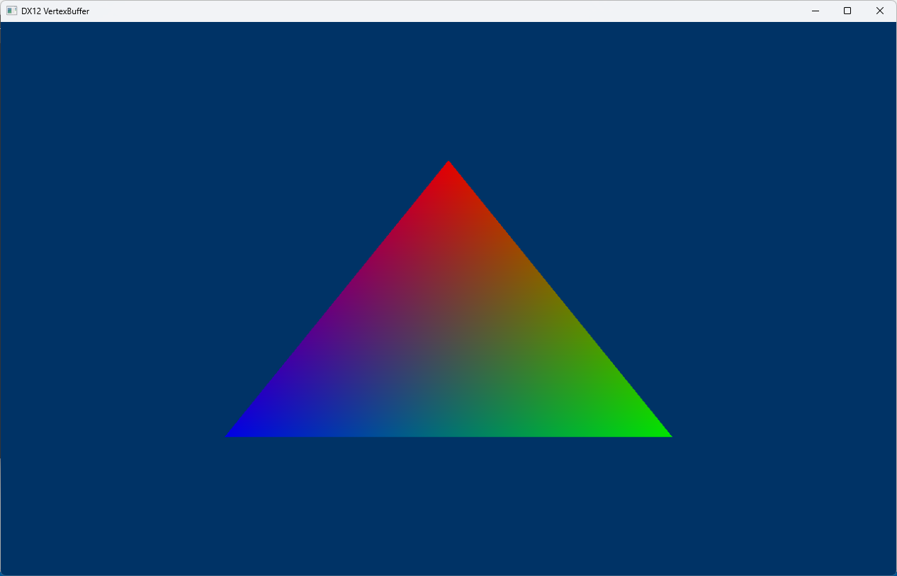
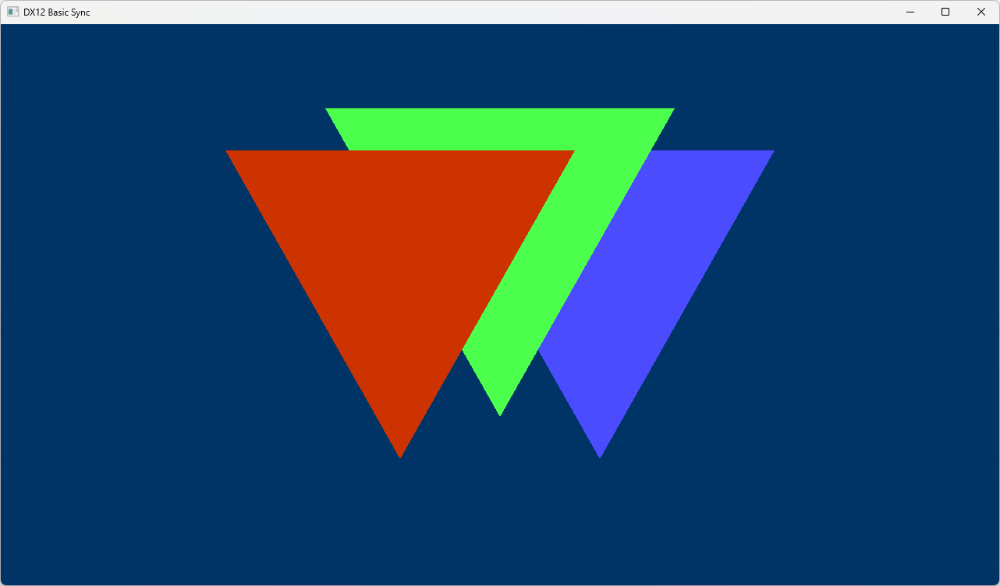

            

# 🌀 DirectX 12 Ultimate® Samples

 

This repository contains **small, progressive DirectX 12 examples**, designed to teach and demonstrate each part of the graphics pipeline in an intuitive and minimalistic way.  
Each sample is isolated and focused, making it easy to learn DX12 step by step, without unnecessary complexity.

 

## Examples

Example | Details
---------|--------
 | [Clear Screen](Src/ClearScreen)  This sample shows how to initialize DirectX 12, select a GPU (adapter), create a device, a command queue, a swap chain, a render target view (RTV) descriptor heap, and a command list to clear the screen to a solid color. All rendering commands are recorded into the command list, then executed through the command queue. 
 | [Pipeline](Src/Pipeline)  We will start drawing geometry onto the screen in this tutorial. We will learn more about Pipeline (PSOs [ID3D12PipelineState])
 | [VertexBuffer](Src/VertexBuffer)  Let's get some color in our scene. In this tutorial we will add color to our vertices to color our triangle. This involves updating the vertex shader to pass the color to the pixel shader, the pixel shader to output the color passed to it, the vertex structure to add a color attribute, and the input layout to include a color input element.
 | [IndexBuffer](Src/IndexBuffer)  In this tutorial we will learn how to use indices to define our triangles. This is useful because we can remove duplicate vertices, as many times the same vertex is used in multiple triangles.
 | [DepthTests](Src/DepthTests)  We will create a depth/stencil buffer, then create a depth/stencil view which we bind to the OM stage of the pipeline
 | [Basic Sync](Src/BasicSynchronizing)  This example adds basic synchronization using ID3D12Fence to ensure that the GPU has completed its work before reusing resources. It also properly handles window resizing by recreating the Render Target Views (RTVs) and Depth/Stencil Views (DSVs) whenever the swap chain is resized.
 | [Blending](Src/Blending)  Here we will learn about a technique called "blending"! This will give us the ability to render "transparent" primitives.
 | [ConstantBuffer](Src/ConstantBuffer)  In this sample, we will learn about matrices, transformations, world/view/projection space matrices, and constant buffers
 | [ImGui](Src/ImGui) This sample shows how to use ImGui with DirectX 12 to control two 3D cubes.

## 📘 Goals

- Help others learn how to use **pure DirectX 12**.
- Serve as a personal reference for building engines or tools.
- Keep things clean, readable, and low-level.

## 🎯 Requirements

- Windows 10/11
- Visual Studio 2019 or newer
- DirectX 12 compatible GPU
